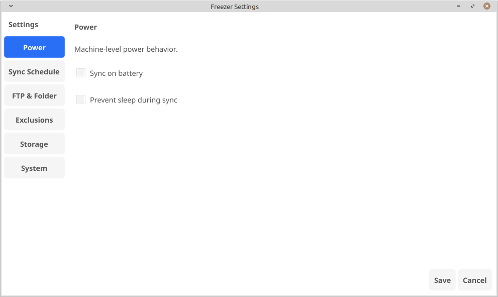
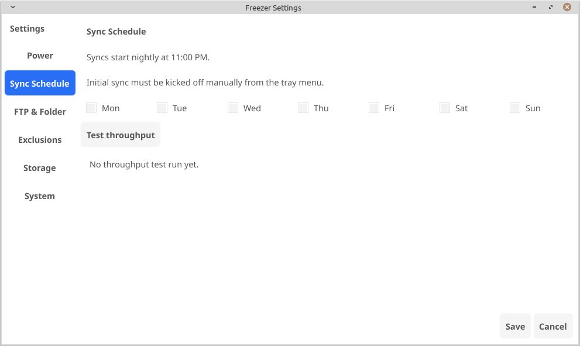
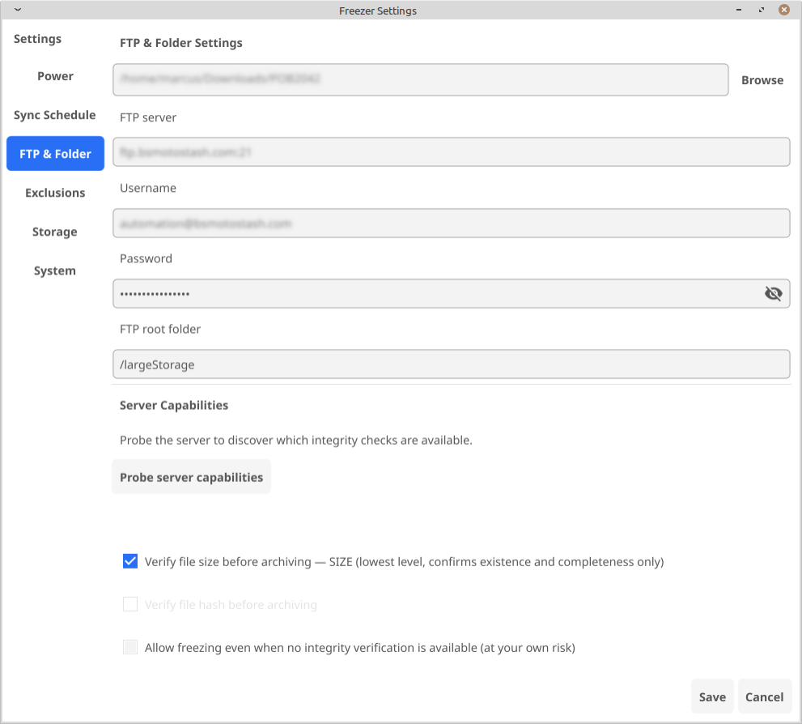
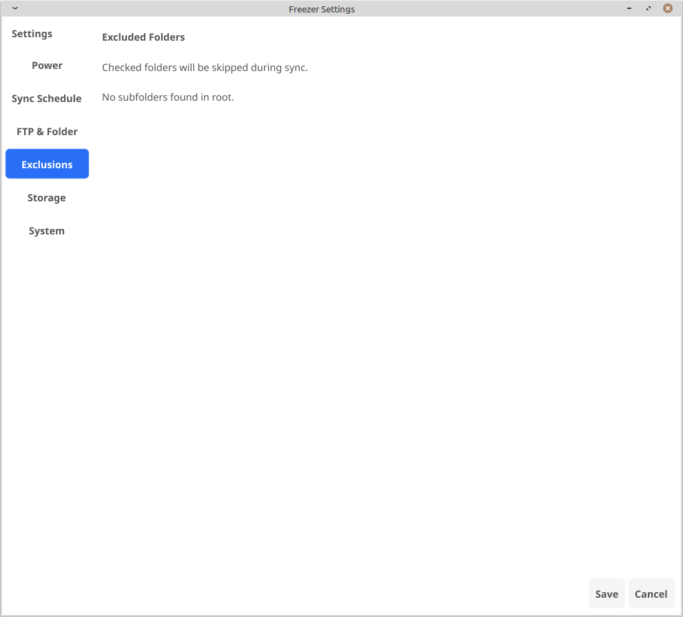
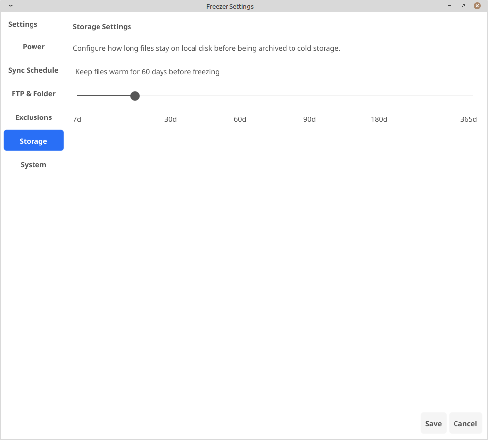
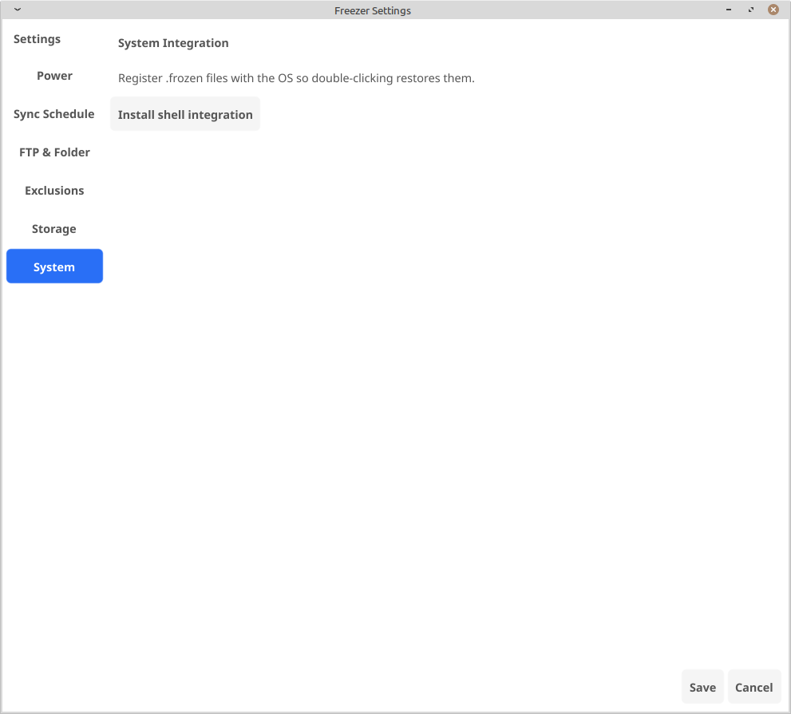

# freezer
A small Go project for using external storage as cold storage. Centered around laptops and environments with fast but small local storage, this lets you automatically move uncommon files to cold storage, to keep a constant churn of free space on your local devices.

## Contents

- [Installation](#installation)
  - [Debian / Ubuntu / Linux Mint](#debian--ubuntu--linux-mint)
  - [Windows 10 / 11](#windows-10--11)
- [Run](#run)
- [Test](#test)
- [How Record Keeping Works](#how-record-keeping-works)
  - [The Record Structure](#the-record-structure)
  - [How Sync Uses the Record](#how-sync-uses-the-record)
  - [File Integrity and FTP Limitations](#file-integrity-and-ftp-limitations)
- [Understanding Shell Integration](#understanding-shell-integration)
  - [Ubuntu / Linux Mint / Debian](#ubuntu--linux-mint--debian)
  - [Windows 10 / 11](#windows-10--11-1)
- [Current Features](#current-features)
  - [Archive and Sync](#archive-and-sync)
  - [File Integrity Verification](#file-integrity-verification)
  - [Restore](#restore)
  - [Settings Panels](#settings-panels)
  - [Platform](#platform)
- [Screenshots](#screenshots)
- [Planned Features](#planned-features)
  - [File Integrity](#file-integrity)
  - [Multi-User and Access Control](#multi-user-and-access-control)
  - [Security](#security)
  - [Storage Backends](#storage-backends)
  - [Migration and Uninstall](#migration-and-uninstall)
  - [Scheduling](#scheduling)
  - [Uninstall and Data Recovery](#uninstall-and-data-recovery)

## Installation

### Debian / Ubuntu / Linux Mint

Install build dependencies:

```bash
sudo apt update
sudo apt install -y golang-go gcc \
  libgl1-mesa-dev libwayland-dev libdbus-1-dev \
  libasound2-dev libxxf86vm-dev libayatana-appindicator3-dev
```

Clone and build:

```bash
git clone https://github.com/hackerseraph/freezer.git
cd freezer
go build -o freezer .
```

Run:

```bash
./freezer
```

To open settings on first run:

```bash
./freezer -settings
```

### Windows 10 / 11

Install Go from https://go.dev/dl/ and TDM-GCC from https://jmeubank.github.io/tdm-gcc/ (required for CGo). Restart your terminal after both installs so PATH updates take effect.

Clone and build:

```powershell
git clone https://github.com/hackerseraph/freezer.git
cd freezer
go build -o freezer.exe .
```

Run:

```powershell
.\freezer.exe
```

To open settings on first run:

```powershell
.\freezer.exe -settings
```

The app runs as a system tray icon. Look for it in the notification area (bottom right, click the ^ arrow if it is not visible).

## Run
go run .

## Test
go test ./...

## How Record Keeping Works

Freezer maintains a state index at `.coldstorage/index.json` inside your root folder. This file is the source of truth for everything Freezer knows about your archived files. It functions like an inode map: the full local path of each file is the key, and the value is a record containing all the metadata Freezer needs to manage that file.

### The Record Structure

Each tracked file has a record with the following fields:

- `local_path` - the absolute path where the file lives (or lived) on disk
- `remote_path` - the full path on the FTP server where the content is stored
- `uploaded_at` - timestamp of the last successful upload
- `expires_at` - when the local copy is scheduled to be replaced with a .frozen stub
- `placeholder` - true if the file has been archived and only a .frozen stub exists locally
- `content_hash` - SHA-256 hash of the file content at the time of upload
- `last_modified` - the file's modification time on disk at the time of upload

### How Sync Uses the Record

When Freezer syncs, it walks your root folder and checks each file against the index. A file is uploaded if there is no record for it, if the local modification time is newer than what was recorded, or if the expiry has passed. After a successful upload the record is written with the new hash, timestamps, and expiry date.

When the expiry date passes, Freezer checks that the file exists on the FTP server and then replaces the local file with a `.frozen` stub. The record is updated to mark `placeholder: true`. The original content remains on FTP indefinitely.

When you restore a file, Freezer downloads from the remote path in the record, writes the content back to the original local path, deletes the `.frozen` stub, and resets the expiry clock.

### File Integrity and FTP Limitations

At upload time Freezer computes a SHA-256 hash of the local file and stores it in the record. This hash is used to detect whether a file has changed since it was last uploaded.

However, verifying that the file on the FTP server has the same hash is a different problem. Standard FTP (RFC 959) has no hash or checksum command. The only standard way to check the remote file is to download it again and hash it locally, which would double the bandwidth cost of every archive operation.

Some FTP servers support optional extensions like `XCRC`, `XSHA1`, `XSHA256`, or the RFC 3659 `HASH` command, but these are not guaranteed to be present and a plain FTP server will not have them.

What Freezer currently does before archiving a local file is call the standard `SIZE` command to confirm the remote file exists and is non-zero. This catches missing or empty files but will not catch a truncated upload where the server accepted a partial write without error.

Adding optional hash verification via the extended `HASH` command (falling back to size-only when the server does not support it) is listed as a planned improvement.

## Understanding Shell Integration

Freezer replaces archived files with `.frozen` stub files so you can see what has been moved to cold storage without losing the file name or folder structure. Shell integration teaches the operating system to open those stubs with Freezer when you double-click them, triggering an automatic restore from your FTP server.

### Ubuntu / Linux Mint / Debian

Clicking "Install shell integration" in Settings > System does the following, all within your home directory with no root access required:

Writes a MIME type definition to `~/.local/share/mime/packages/freezer.xml` that tells the OS `.frozen` files belong to the type `application/x-freezer-placeholder`. Runs `update-mime-database` to register it.

Writes a desktop handler to `~/.local/share/applications/freezer-restore.desktop` that tells any XDG-compliant file manager (Thunar, Nautilus, Nemo, Dolphin) to run `freezer -restore %f` when a file of that type is opened. Runs `update-desktop-database` to register it.

Calls `xdg-mime default freezer-restore.desktop application/x-freezer-placeholder` to set Freezer as the default handler for that MIME type.

The result is that double-clicking a `.frozen` file in any supported file manager runs `freezer -restore /full/path/to/file.ext.frozen`, which connects to FTP, downloads the original content, and replaces the stub with the real file.

To uninstall: delete `~/.local/share/mime/packages/freezer.xml` and `~/.local/share/applications/freezer-restore.desktop`, then run `update-mime-database ~/.local/share/mime` and `update-desktop-database ~/.local/share/applications`.

### Windows 10 / 11

Clicking "Install shell integration" in Settings > System writes four registry keys under `HKEY_CURRENT_USER` using `reg add`. Because it targets the current user hive rather than `HKLM`, no UAC prompt or administrator rights are required.

```
HKCU\Software\Classes\.frozen
  (Default) = FreezerPlaceholder

HKCU\Software\Classes\FreezerPlaceholder
  (Default) = Freezer Archive File

HKCU\Software\Classes\FreezerPlaceholder\DefaultIcon
  (Default) = C:\path\to\freezer.exe,0

HKCU\Software\Classes\FreezerPlaceholder\shell\open\command
  (Default) = "C:\path\to\freezer.exe" -restore "%1"
```

The path to `freezer.exe` is resolved at runtime so it points to wherever the binary actually lives. The result is that double-clicking any `.frozen` file in Windows Explorer runs `freezer.exe -restore "C:\path\to\file.ext.frozen"`, which connects to FTP, downloads the original content, and replaces the stub with the real file.

To uninstall: delete the `HKCU\Software\Classes\.frozen` and `HKCU\Software\Classes\FreezerPlaceholder` keys from the registry.

## Current Features

### Archive and Sync
- Files in the configured root folder are uploaded to an FTP server and tracked with SHA-256 content hashes and file size
- Configurable retention period (7 to 365 days) set via slider in Storage Settings; default is 60 days
- Files past their retention date are replaced with a `.frozen` stub on disk; content remains on FTP
- Modified files are automatically detected by modification time and re-uploaded; expiry clock resets
- Subfolders can be excluded from sync via checkboxes in the Exclusions panel

### File Integrity Verification
- Before archiving a local file, Freezer optionally verifies the remote copy using:
  - SIZE command: confirms the remote file size matches the locally recorded size (works on all FTP servers)
  - Hash command: confirms content via HASH, XSHA256, XMD5, or XCRC if the server supports it
- FTP server capabilities are discovered by clicking "Probe server capabilities" in FTP settings, which sends FEAT and auto-enables the best available verification method
- An "allow unsafe freeze" option lets users archive even when no verification is available, with explicit acknowledgement of the risk
- Files that fail verification are skipped and logged rather than silently archived

### Restore
- All placeholders can be restored at once from the tray menu
- Individual files can be restored by double-clicking the `.frozen` stub after running shell integration install
- Shell integration registers `.frozen` files with the OS on both Windows and Linux

### Settings Panels
- Power: sync on battery toggle, prevent sleep during sync (systemd-inhibit on Linux, Windows API on Windows)
- Sync Schedule: weekday selection for nightly scheduled sync
- FTP and Folder: server, credentials, FTP root, local folder browser with sidebar/breadcrumbs/history, FTP throughput test with progress spinner, server capability probe and integrity verification options
- Exclusions: checkboxes for each subfolder in the root folder, auto-populated when root changes
- Storage: retention period slider (7 to 365 days) with labelled tick marks
- System: install shell integration for double-click restore on Linux and Windows

### Platform
- Runs on Windows 10/11 and Linux (Debian, Ubuntu, Mint, and compatible distributions)
- System tray icon with sync now, restore, open folder, and quit options
- Startup log written to the OS cache directory for diagnosing silent crashes

## Screenshots

### Power


### Sync Schedule


### FTP & Folder


### Exclusions


### Storage


### System Integration


## Planned Features

### File Integrity
- Content hashing upgrade: migrate from SHA-256 to MD5+SHA-256 dual hashing for faster change detection on large files while retaining collision resistance for archival verification
- File fingerprinting: maintain an inode/fingerprint index alongside the archive state so renamed or moved files are recognised as the same file rather than re-uploaded as new

### Multi-User and Access Control
- File locking: advisory locks to prevent simultaneous archive/restore conflicts when multiple users or machines share the same FTP root
- Users and groups: per-user configuration profiles and group-based access policies so shared deployments can restrict which folders each user can archive or restore
- Admin roles: privilege tiers (admin / operator / read-only) with audit logging of all archive and restore actions

### Security
- Host-side encryption: encrypt file content before upload so the FTP server holds only ciphertext; decryption happens locally on restore
- Shared key management: distribute symmetric keys to authorised clients without embedding credentials in config files
- Certificate-based auth: WireGuard-style keypair authentication for FTP sessions, eliminating plaintext username/password credentials in settings
- Virus scanning: integrate ClamAV to scan files on restore before writing them back to disk, blocking any malware that may have been uploaded by another client

### Storage Backends
- External drives: archive to a locally attached USB or eSATA drive instead of a network server, with automatic detection when the drive is connected and graceful handling when it is not
- FTP: current default backend (already implemented)
- NFS shares: mount and write directly to NFS exports, suitable for home lab NAS devices and Linux servers
- CIFS/SMB shares: support Windows file shares and Samba, covering NAS appliances and Windows Server environments
- Cloud storage: Google Drive, OneDrive, and Dropbox as archive targets via their respective APIs, selectable from the settings UI alongside FTP and local network options
- Pluggable backend interface: common abstraction layer so additional backends can be added without changes to the core sync logic

### Migration and Uninstall
- Migrate tray menu item: move all archived content from the current backend to a new one (e.g. FTP to Google Drive) without losing state, rewriting remote paths in the index as transfers complete
- Uninstall tray menu item: rewarm all frozen files back to local disk, remove all .frozen stubs and the .coldstorage metadata directory, deregister shell integration, and optionally delete archived content from the remote backend, leaving the system in a clean pre-Freezer state
- Pre-uninstall disk space check: calculate total rewarm size before starting and warn the user if there is not enough local space, offering the date-range partial restore slider if needed
- Migration log: write a persistent log of every file transferred during a migration so that if the process is interrupted by a power outage or crash it can resume from where it left off rather than starting over, and any partially transferred files can be detected and retried

### Scheduling
- Flexible schedules: cron-style scheduling beyond the current nightly fixed time, with per-folder schedule overrides
- Nightly cleanup routine: detect and resolve interrupted freeze operations left in a partial state (original file deleted but .frozen stub missing, or stub present with no state record) and reconcile them against the FTP server automatically

### Uninstall and Data Recovery
- Graceful uninstall routine: before removal, rewarm all frozen files from FTP back to local disk and remove all .frozen stubs and the .coldstorage metadata directory, leaving the folder in a clean pre-Freezer state
- Disk space check before rewarm: before restoring any file, verify available local disk space against the total size of all archived content and warn the user if there is not enough room
- Partial rewarm with priority ordering: when there is insufficient space to restore everything, allow the user to choose which files or folders to restore first, or restore by most-recently-archived order until the disk is full
- Date-range rewarm slider: when disk space is limited, show a slider letting the user select how far back to rewarm (e.g. last 7 days, last 30 days). Tick marks on the slider correspond to real archive dates, and the UI calculates and displays the cumulative size that would be restored at each position so the user can find the cutoff that fits their available space before committing
- Rewarm progress reporting: show per-file and overall progress during a full restore so the user knows how long the operation will take and which files have been recovered
